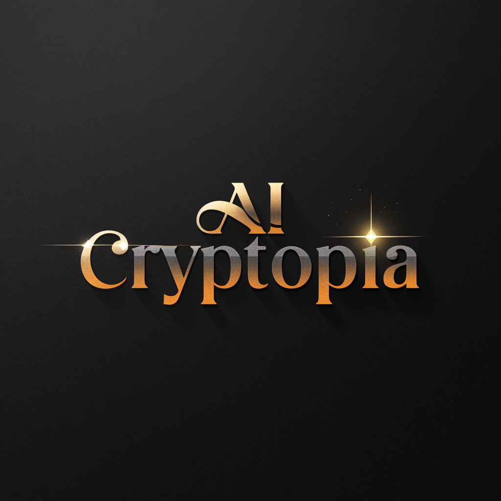

# AICryptopia Organization Website



## Overview
AICryptopia is an open-source organization focused on building AI-powered tools and applications on Web3. This repository hosts our organization's website and documentation.

## Quick Links
- 📚 [Documentation](docs/README.md)
- 🛡️ [Security Policy](docs/SECURITY.md)
- 📝 [Project Management](.github/PROJECT_MANAGEMENT.md)
- 🌿 [Branching Strategy](docs/BRANCHING_STRATEGY.md)
- ⚖️ [License](LICENSE)
- 🚀 [Getting Started](docs/GETTING_STARTED.md)
- 🤝 [Contributing Guide](docs/CONTRIBUTING.md)
- 🏗️ [Architecture Overview](docs/ARCHITECTURE.md)

## Project Structure
```
.
├── .github/           # GitHub specific files and workflows
├── components/        # Reusable UI components
├── css/              # Stylesheets
├── docs/             # Project documentation
├── images/           # Static images and assets
├── js/               # JavaScript files
├── pages/            # Additional HTML pages
├── tests/            # Test files
├── .htaccess         # Apache server configuration
├── .prettierrc       # Code formatting configuration
├── 404.html          # Custom 404 error page
├── CNAME             # Custom domain configuration
├── index.html        # Main website
├── package.json      # Project dependencies and scripts
└── site.webmanifest  # Web app manifest
```

## Development
This website is built with vanilla HTML, CSS, and JavaScript, focusing on simplicity and functionality. It uses GitHub Pages for hosting and automated deployment.

### Development Tools
- **Code Formatting**: Prettier for consistent code style
- **Testing**: Jest for unit testing
- **CI/CD**: GitHub Actions for automated workflows
- **Dependency Management**: npm for package management

### Available Scripts
```bash
npm run format    # Format code using Prettier
npm test         # Run tests using Jest
```

## Contributing
We welcome contributions! Please check our [Contributing Guide](docs/CONTRIBUTING.md) for detailed information on:
- Setting up your development environment
- Our coding standards
- The contribution process
- How to submit pull requests

## License
This project is licensed under the MIT License - see the [LICENSE](LICENSE) file for details. 